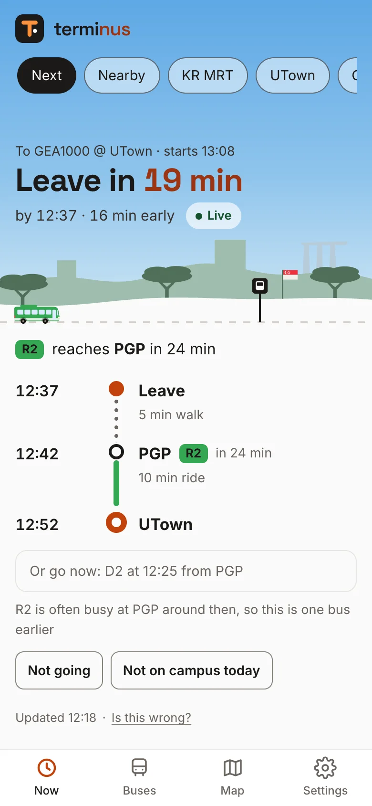
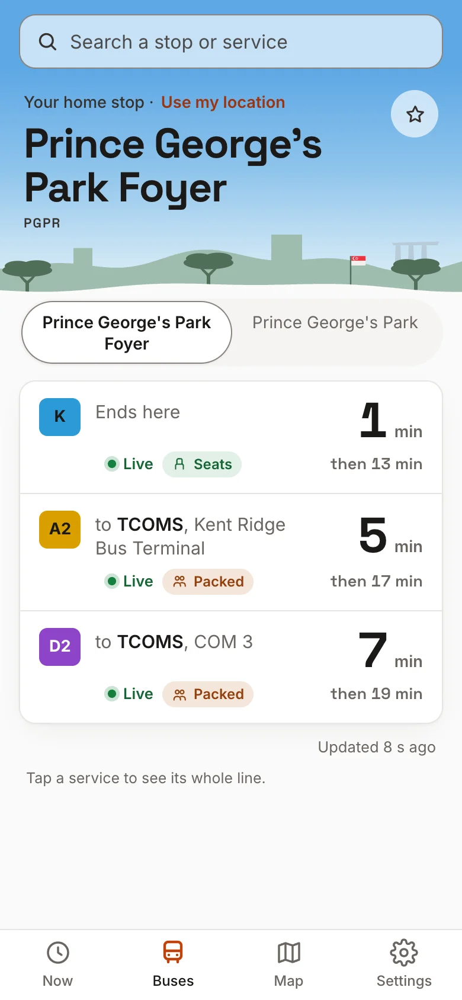

<a href="https://terminus.run">
  <picture>
    <source media="(prefers-color-scheme: dark)" srcset=".github/readme/banner-dark.webp">
    
  </picture>
</a>

<p align="center">
  <a href="https://terminus.run/download/android"></a>
  <a href="https://terminus.run/download/mac"></a>
  <a href="https://terminus.run/account"></a>
</p>

<p align="center">
  <sub>Free · Android 12+ · macOS 14+ on Apple silicon · <a href="https://terminus.run">terminus.run</a> · <a href="https://terminus.run/docs">API docs</a></sub>
</p>

<br>

terminus reads your NUSMods timetable and answers one question: **which bus do I
catch, and will I make it?** It knows teaching weeks and holidays, picks the stop
on the right side of the road, and says when walking is faster. On your home
screen, in your menu bar and on the web, under a sky that follows the hour.

How it was built, and why it runs on one Cloudflare Worker:
[Building terminus](https://rcn.sh/blog/building-terminus).

## On your phone, your Mac and the web

The same answer on your home screen, in your menu bar and on the web, in light or dark.

<table>
  <tr>
    <td width="56%" valign="top">
      <picture>
        <source media="(prefers-color-scheme: dark)" srcset="apps/web/public/assets/shots/widget-dark.webp">
        
      </picture>
      <h3>On your home screen</h3>
      A widget that keeps itself up to date, with your favourites one tap away, and a live notification when it's time to go.
    </td>
    <td width="44%" valign="top">
      <picture>
        <source media="(prefers-color-scheme: dark)" srcset="apps/web/public/assets/shots/mac-dark.webp">
        
      </picture>
      <h3>In your menu bar</h3>
      When to leave, in the menu bar. Click for the whole trip, your favourites, or anywhere else on campus.
    </td>
  </tr>
  <tr>
    <td width="50%" valign="top">
      <picture>
        <source media="(prefers-color-scheme: dark)" srcset=".github/readme/now-dark.webp">
        
      </picture>
      <h3>On the web</h3>
      The app in any browser, under a sky that follows the hour, with your trip drawn as a line. Add it to your home screen like an app, with notifications when it's time to leave.
    </td>
    <td width="50%" valign="top">
      <picture>
        <source media="(prefers-color-scheme: dark)" srcset=".github/readme/buses-dark.webp">
        
      </picture>
      <h3>Every stop's buses</h3>
      The Buses tab: search any stop or service for what's coming, live, and how full it usually is. On Android and the web.
    </td>
  </tr>
</table>

## What it knows

<table>
  <tr>
    <td width="33%" valign="top">
      <h3>Follows your timetable</h3>
      Import from NUSMods once a semester; the week before the next one starts, it reminds you. It knows teaching weeks, recess, exams and public holidays, and sends you home in long gaps.
    </td>
    <td width="33%" valign="top">
      <h3>Leave at the right time</h3>
      The latest bus that still gets you there, walks along campus paths at your pace, and a bus earlier when yours is usually busy.
    </td>
    <td width="33%" valign="top">
      <h3>The right side of the road</h3>
      The stop going your way, even when the one across the road is closer. Inside your hall, only the stops you can walk to. Or check any stop with one tap.
    </td>
  </tr>
</table>

### And a map of campus

<picture>
  <source media="(prefers-color-scheme: dark)" srcset="apps/web/public/assets/shots/map-dark.webp">
  
</picture>

On Android, the web and the Mac (in a window of its own): every bus route in its colour, on a quiet street map. Tap a service to see its line and its buses moving live; tap a bus for where it's going and the stops ahead; tap a stop for what's coming and a way to go there. It works offline after the first look.

## Set up in two minutes

**On Android:** install the app and tap **Get started**. It asks where you live, for your NUSMods timetable (paste the share link, or tap Share in NUSMods and pick terminus) and how fast you walk. No account or email needed; add an email later in Settings to keep your setup and use it on other devices.

**On the web or a Mac:**

1. **Sign in** at [terminus.run/account](https://terminus.run/account) with a code or link sent to your email. No password.
2. **Import** your NUSMods share link and pick your home stop.
3. **Install** the Mac menu bar app and sign in with the same email: approve it from the link we email you, on any device, by choosing the number the Mac shows. Or pair it with a code from the account page or the Android app's Settings.

It updates through the day and goes quiet in the evening. The app has four tabs: **Now** (the card and your places), **Buses** (any stop's buses, live), **Map** and **Settings**.

<details>
<summary><b>Installing outside the app stores</b></summary>
<br>

- **Android:** open the downloaded file and allow your browser to install apps when asked. Play Protect may ask you to confirm, since it isn't from the Play Store.
- **Mac:** open the disk image and drag terminus to Applications. The first time you open it, macOS stops it, as it isn't from an identified developer: choose Done, then Open Anyway in System Settings, under Privacy & Security.

</details>

## How it fits together

<picture>
  <source media="(prefers-color-scheme: dark)" srcset=".github/readme/diagram-dark.webp">
  
</picture>

The Worker does all the thinking, and caches the NUS feed for 15 seconds per stop. Every client shows the same ready-made card
from `/api/me/next` (when to leave, which bus, when you arrive) and only counts
down the clock itself, so no screen ever shows a stale "4 min".

| Path | What |
| --- | --- |
| [`apps/api`](apps/api) | Cloudflare Worker: the API, accounts (D1), the cron monitor, and the website. API docs at [/docs](https://terminus.run/docs). |
| [`apps/web`](apps/web) | Landing page, account page, the web app (Now, Buses, the campus map, Settings), privacy and pairing pages. HTML and Preact components with no build step, served by the Worker. |
| [`apps/android`](apps/android) | Home-screen widgets (compact and with places) and the app: Now, Buses, the campus map, Settings. |
| [`apps/macos`](apps/macos) | Menu bar app, with the campus map in a window. |

More in [ARCHITECTURE.md](ARCHITECTURE.md), and in depth in
[apps/api/docs/internals.md](apps/api/docs/internals.md).

## Quickstart

Node 22.18 or later and pnpm (the version is pinned in `package.json`).

```bash
pnpm install
pnpm check                            # API tests and typecheck: no network, no keys
pnpm lint                             # oxlint; warnings fail
node apps/api/scripts/dev-stub.mjs    # the Worker and website with fake buses on :8787
```

Open http://localhost:8787 and sign in as `you@u.nus.edu` with the code the
stub prints. The stub needs no keys. Its options (`PORT`, `STUB_HOST`,
`STUB_NOW`, `STUB_HOURS`, `STUB_TLS`, `CLASS_IN_MIN`) are described at the
top of [`apps/api/scripts/dev-stub.mjs`](apps/api/scripts/dev-stub.mjs).

Against the live NUS feed, with `cf dev`:

```bash
cd apps/api
cp .dev.vars.example .dev.vars        # fill in; never commit it
pnpm dev
```

## Configuration

The Worker's config is [`apps/api/cloudflare.config.ts`](apps/api/cloudflare.config.ts):
one config, two Workers (`terminus`, and `terminus-beta` with `--mode beta`),
each with its own D1, KV, R2 bucket, rate-limit namespaces and Analytics
Engine dataset. [`wrangler.config.ts`](apps/api/wrangler.config.ts) only sets
the website directory (`../web/public`). Every binding is typed in
[`src/types.ts`](apps/api/src/types.ts) (`Env`); only `KV` is required at run
time, and `/api/health` says what's missing.

Secrets go in `apps/api/.dev.vars` locally (template:
[`.dev.vars.example`](apps/api/.dev.vars.example)) and on the Worker with
`cf workers secrets update`. Their values aren't in this repository.

| Secret | Declared | What |
| --- | --- | --- |
| `NEXTBUS_AUTH_BASE` | yes | uNivUS host for the guest token |
| `NEXTBUS_PROXY_BASE` | yes | uNivUS bus proxy |
| `NEXTBUS_PROXY_API_KEY` | yes | Sent as `x-api-key` to the proxy |
| `NEXTBUS_HTD_API`, `NEXTBUS_APP_API` | yes | Headers for the token request |
| `NEXTBUS_APP_VERSION` | yes | Current uNivUS release string. KV `config:appVersion` overrides it |
| `ALERT_EMAIL` | yes | Where outage alerts and feedback go |
| `HEALTH_TOKEN` | yes | Operator token (`x-health-token`): dashboard, `/api/health?probe=1` |
| `TURNSTILE_SECRET` | yes | Turnstile on web sign-in. Unset: the check is skipped |
| `FCM_SERVICE_ACCOUNT` | yes | Firebase service account JSON, for Android push |
| `VAPID_PRIVATE_KEY` | yes | Web Push key, a P-256 JWK (`scripts/vapid-key.mjs`) |
| `LTA_ACCOUNT_KEY` | no | LTA DataMall key, for public buses. Unset: shuttles only |
| `ANALYTICS_TOKEN` | no | Lets the dashboard query Analytics Engine |
| `TIMELAPSE_TOKEN` | no | Opens `/api/timelapse/*` for the machine that renders videos |
| `NEXTBUS_DEVICE_ID` | no | 16 hex characters. Unset: one is made and kept in KV |
| `NEXTBUS_REQUESTED_BY`, `NEXTBUS_SECURED_REQUEST` | no | Sent if set; not required upstream |

"Declared" secrets are listed with `bindings.secret()` in the config, so
`cf deploy` keeps them. The others are optional, so a site deploys without them.

Plain variables, set in the config:

| Variable | What |
| --- | --- |
| `EMAIL_FROM` | Sender for sign-in mail (a domain onboarded to Email Sending) |
| `TURNSTILE_SITE_KEY`, `TURNSTILE_HOSTNAMES` | Turnstile's public key, and the hostnames a pass must come from |
| `CF_ACCOUNT_ID` | Account owning the Analytics Engine dataset |
| `PUBLIC_ORIGIN` | The site's origin. Set on the beta; default `https://terminus.run` |
| `LINK_ORIGIN` | Origin for links in emails, if not `PUBLIC_ORIGIN` |
| `MOVE_PAGES` | `on`: pages on the old address redirect to the new one |
| `AE_DATASET` | Analytics Engine dataset the dashboard reads. Default `terminus` |
| `TIMELAPSE_ENABLED` | `on` lets the timelapse recorder poll (KV `config:timelapse` overrides) |

Bindings:

| Binding | Type |
| --- | --- |
| `DB` | D1: accounts, sessions, profiles ([`migrations/`](apps/api/migrations)) |
| `KV` | KV: tokens, calendar, feed state, runtime config |
| `DOWNLOADS` | R2: app builds, `latest.json`, the appcast, the street map, timelapse days |
| `TRIPS`, `TIMELAPSE`, `FEED_GATE` | Durable Objects (`Trip`, `TimelapseRecorder`, `FeedGate`) |
| `AE` | Analytics Engine dataset |
| `EMAIL` | Email Sending |
| `RL_AUTH`, `RL_PUBLIC`, `RL_ME`, `RL_MAIL`, `RL_ANON`, `RL_PAIR`, `RL_MAP` | Workers rate limiting |
| `ASSETS` | The website, `apps/web/public` |

Runtime switches in KV, changed without a deploy: `config:appVersion`,
`config:minClient` (oldest app version served) and `config:timelapse`.

## Deployment

`main` isn't deployed automatically. From `apps/api`, signed in with
`cf auth login`:

```bash
pnpm run deploy         # stable: terminus.run
pnpm run deploy:beta    # beta: beta.terminus.run
```

Use `pnpm run deploy`, not `pnpm deploy`, which is a pnpm built-in. Each runs
[`scripts/predeploy.mjs`](apps/api/scripts/predeploy.mjs) (refuses
uncommitted changes in `apps/api` or `apps/web/public`, then runs
`pnpm check`), applies pending D1 migrations with `cf d1 migrations apply`,
then runs `cf deploy` (`--mode beta` for the beta). Migrations must be
additive; see [internals.md](apps/api/docs/internals.md).

Check a deploy builds without sending anything:

```bash
pnpm exec cf deploy --dry-run
```

On a new Cloudflare account, create the resources, put their ids and names
in `cloudflare.config.ts`, then set the secrets:

```bash
pnpm exec cf d1 create --name terminus
pnpm exec cf kv namespaces create --title terminus
pnpm exec cf r2 buckets create --name terminus-downloads
pnpm exec cf workers secrets update NEXTBUS_AUTH_BASE --worker terminus --type secret_text --text '…'
```

Email Sending needs the Workers Paid plan and the sender's domain onboarded
under Email Service in the dashboard. The custom domains in the config are
mine; change them, and `EMAIL_FROM` with them.

## Clients

| | Build | Details |
| --- | --- | --- |
| Android | `cd apps/android && ./gradlew :app:installStableDebug` | [apps/android](apps/android/README.md) |
| Mac | `cd apps/macos && ./build.sh` | [apps/macos](apps/macos/README.md) |
| Web | none: served from `apps/web/public` by the Worker | [apps/web](apps/web/README.md) |

Point a debug client at the dev stub: `-PapiBase=http://localhost:8787` plus
`adb reverse tcp:8787 tcp:8787` on Android, `TERMINUS_API_BASE=http://localhost:8787`
on the Mac.

Releases run on my Mac with `scripts/release.sh` (betas:
`scripts/release-beta.sh <x.y.z-beta.n>`), once the Worker serving that
version is deployed. It runs the tests; builds one Android APK per CPU type
and the signed Mac DMG with its Sparkle appcast; uploads them to R2; then
tags the commit and publishes the GitHub release. `--dry-run` builds into
`build/dry-run/`. The signing keys live off the repo, so a build without
them comes out unsigned (Android) or ad-hoc signed (Mac). The campus street
map goes to R2 with the **map tiles** workflow or `scripts/map-tiles.sh`.

See [CONTRIBUTING.md](CONTRIBUTING.md) to send a change.

<br>

<p align="center">
  <sub>An independent student project, not affiliated with NUS. Bus times come from NUS's shuttle feed.<br>
  Use terminus in line with the <a href="https://nus.edu.sg/registrar/docs/info/registration-guides/aup-form.pdf">NUS Acceptable Use Policy for IT Resources</a>.<br>
  Walking routes, bus route lines and the street map use map data © <a href="https://www.openstreetmap.org/copyright">OpenStreetMap</a> contributors, the street map through <a href="https://protomaps.com">Protomaps</a>. <a href="LICENSE">MIT licensed</a>.</sub>
</p>
