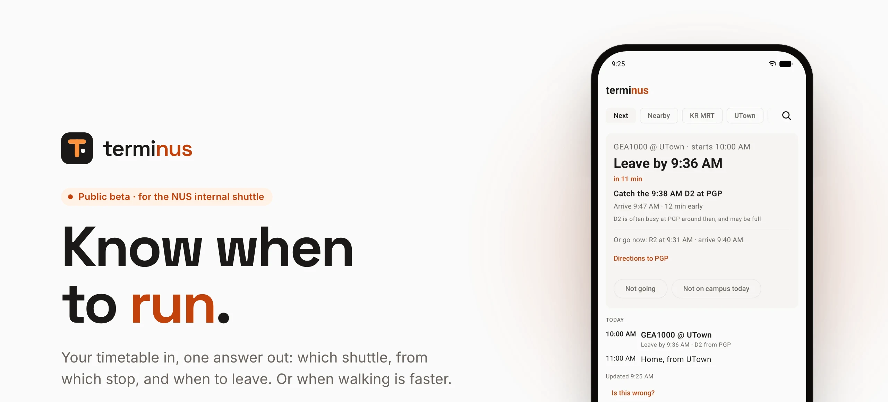
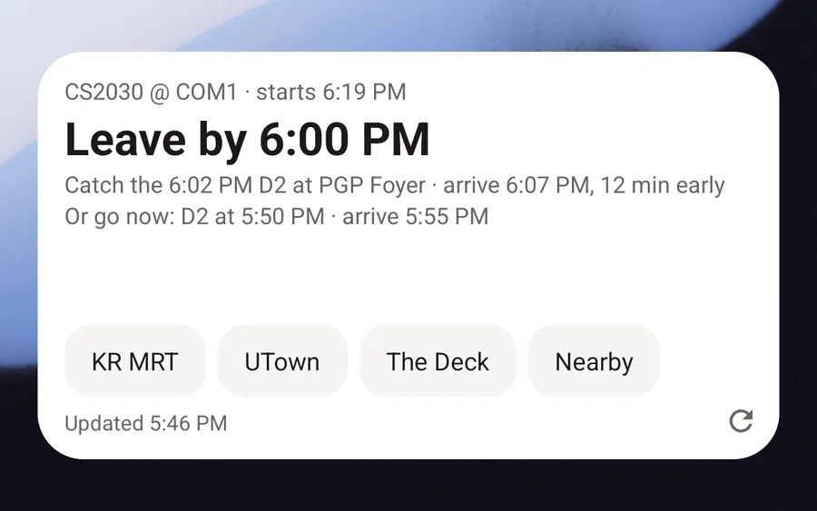
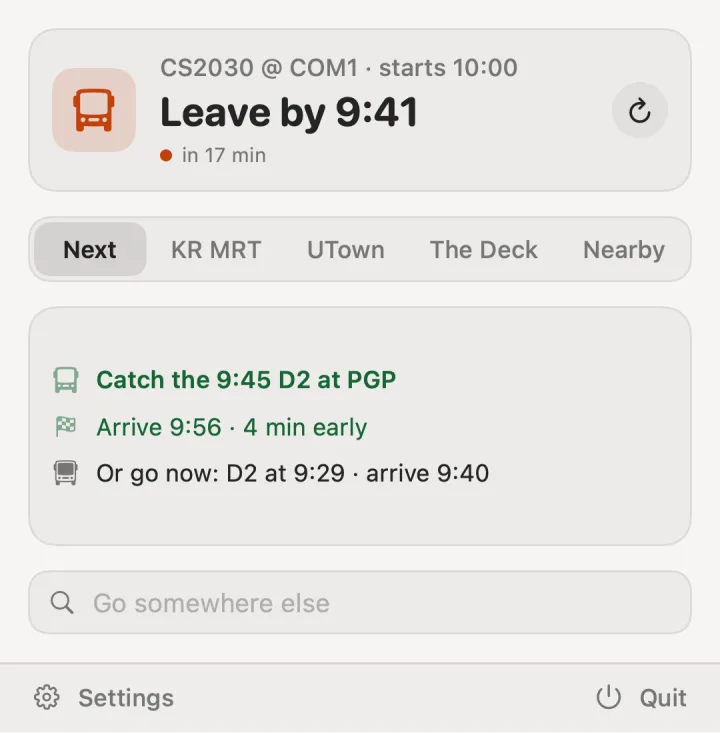

<a href="https://terminus.rcn.sh">
  <picture>
    <source media="(prefers-color-scheme: dark)" srcset=".github/readme/banner-dark.webp">
    
  </picture>
</a>

<p align="center">
  <a href="https://terminus.rcn.sh/download/android"></a>
  <a href="https://terminus.rcn.sh/download/mac"></a>
  <a href="https://terminus.rcn.sh/account"></a>
</p>

<p align="center">
  <sub>Free · Android 12+ · macOS 14+ on Apple silicon · <a href="https://terminus.rcn.sh">terminus.rcn.sh</a> · <a href="https://terminus.rcn.sh/docs">API docs</a></sub>
</p>

<br>

terminus reads your NUSMods timetable and answers one question: **which bus do I
catch, and will I make it?** It knows teaching weeks and holidays, picks the stop
on the right side of the road, and says when walking is faster. On your home
screen, in your menu bar and on the web.

## Wherever you look

The same answer on your phone, your Mac and the web, in light or dark.

<table>
  <tr>
    <td width="56%" valign="top">
      <picture>
        <source media="(prefers-color-scheme: dark)" srcset="apps/web/public/assets/shots/widget-dark.webp">
        
      </picture>
      <h3>On your home screen</h3>
      A widget that keeps itself up to date, with your saved places one tap away. Or a live notification, and a heads-up before you need to leave.
    </td>
    <td width="44%" valign="top">
      <picture>
        <source media="(prefers-color-scheme: dark)" srcset="apps/web/public/assets/shots/mac-dark.webp">
        
      </picture>
      <h3>In your menu bar</h3>
      When to leave, one glance up. The rest, a click away.
    </td>
  </tr>
</table>

## What it knows

<table>
  <tr>
    <td width="33%" valign="top">
      <h3>Your timetable</h3>
      Import from NUSMods once. It knows teaching weeks, recess, exams and public holidays, and sends you home in long gaps.
    </td>
    <td width="33%" valign="top">
      <h3>The right time</h3>
      The latest bus that still gets you there, walks along real campus paths at your pace, and a bus earlier when yours is usually packed.
    </td>
    <td width="33%" valign="top">
      <h3>The right stop</h3>
      The one going your way, even when the stop across the road is closer. Inside your hall, only the stops you can really walk to.
    </td>
  </tr>
</table>

## Set up in two minutes

1. **Sign in** at [terminus.rcn.sh/account](https://terminus.rcn.sh/account) with a code sent to your email. No password.
2. **Import** your NUSMods share link and pick your home stop.
3. **Install** the Android widget or the Mac menu bar app, and pair it by scanning the QR code or typing the code.

That's it. It updates through the day and goes quiet in the evening.

<details>
<summary><b>Installing outside the app stores</b></summary>
<br>

- **Android:** open the downloaded file and allow your browser to install apps when asked. Play Protect may ask you to confirm, since it isn't from the Play Store.
- **Mac:** unzip, drag terminus to Applications, then right-click it and choose Open. On macOS 15 and later, allow it in System Settings → Privacy & Security.

</details>

## How it fits together

```
NUS shuttle feed (cached 15 s per stop) ─┐
NUSMods timetables ──────────────────────┤
NUS calendar, public holidays ───────────┼──▶  Cloudflare Worker (apps/api)
OpenStreetMap campus paths ──────────────┘          │
                                                    ├──▶  Android widget
                                                    ├──▶  Mac menu bar
                                                    └──▶  Website
```

The Worker does all the thinking. Every client shows the same ready-made card
from `/me/next` (when to leave, which bus, when you arrive) and only counts
down the clock itself, so no screen ever shows a stale "4 min".

| Path | What |
| --- | --- |
| [`apps/api`](apps/api) | Cloudflare Worker: the API, accounts (D1), the cron monitor, and the website. API docs at [/docs](https://terminus.rcn.sh/docs). |
| [`apps/web`](apps/web) | Landing page, account page, privacy and pairing pages. Static files served by the Worker. |
| [`apps/android`](apps/android) | Home-screen widgets (compact and with places) and a small app. |
| [`apps/macos`](apps/macos) | Menu bar app. |

## Running it

```bash
pnpm install
pnpm check                            # tests and typecheck
node apps/api/scripts/dev-stub.mjs    # local API with fake buses on :8787
```

Self-hosting needs your own Cloudflare account (Workers, D1, KV, R2, Email
Sending) and the NUS feed configuration described in
[apps/api/docs/internals.md](apps/api/docs/internals.md). Releases are built and uploaded with
`scripts/release.sh`. See [CONTRIBUTING.md](CONTRIBUTING.md).

<br>

<p align="center">
  <sub>An independent student project, not affiliated with NUS. Bus times come from NUS's shuttle feed.<br>
  Walking routes use map data © <a href="https://www.openstreetmap.org/copyright">OpenStreetMap</a> contributors. <a href="LICENSE">MIT licensed</a>.</sub>
</p>
