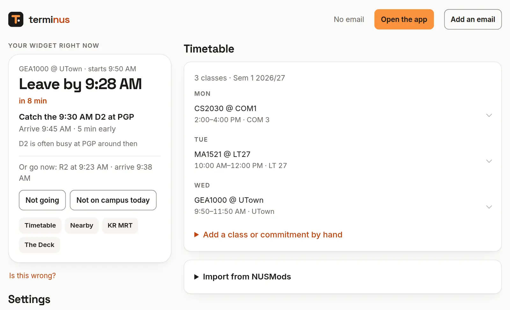
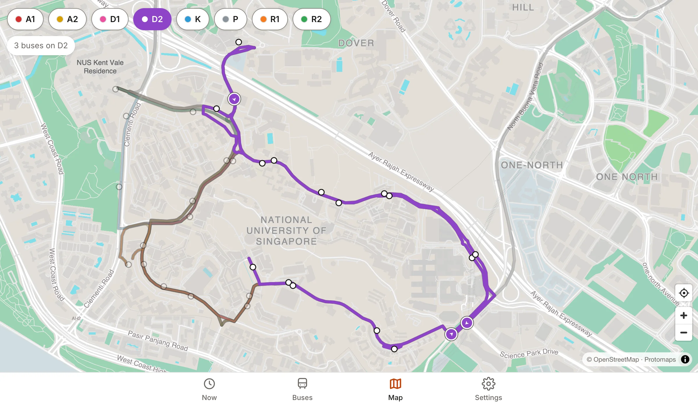

<a href="https://terminus.rcn.sh">
  <picture>
    <source media="(prefers-color-scheme: dark)" srcset=".github/readme/banner-dark.webp">
    
  </picture>
</a>

<p align="center">
  <a href="https://terminus.rcn.sh/download/android"></a>
  <a href="https://terminus.rcn.sh/download/mac"></a>
  <a href="https://terminus.rcn.sh/account"></a>
</p>

<p align="center">
  <sub>Free · Android 12+ · macOS 14+ on Apple silicon · <a href="https://terminus.rcn.sh">terminus.rcn.sh</a> · <a href="https://terminus.rcn.sh/docs">API docs</a></sub>
</p>

<br>

terminus reads your NUSMods timetable and answers one question: **which bus do I
catch, and will I make it?** It knows teaching weeks and holidays, picks the stop
on the right side of the road, and says when walking is faster. On your home
screen, in your menu bar and on the web.

## On your phone, your Mac and the web

The same answer on your phone, your Mac and the web, in light or dark.

<table>
  <tr>
    <td width="56%" valign="top">
      <picture>
        <source media="(prefers-color-scheme: dark)" srcset="apps/web/public/assets/shots/widget-dark.webp">
        
      </picture>
      <h3>On your home screen</h3>
      A widget that keeps itself up to date, with your saved places one tap away, or a live notification, and a heads-up before you need to leave.
    </td>
    <td width="44%" valign="top">
      <picture>
        <source media="(prefers-color-scheme: dark)" srcset="apps/web/public/assets/shots/mac-dark.webp">
        
      </picture>
      <h3>In your menu bar</h3>
      When to leave, in the menu bar. Click it for the rest.
    </td>
  </tr>
  <tr>
    <td colspan="2" valign="top">
      <picture>
        <source media="(prefers-color-scheme: dark)" srcset="apps/web/public/assets/shots/web-dark.webp">
        
      </picture>
      <h3>On the web</h3>
      The same card in any browser, with your timetable and settings beside it. Add it to your home screen for the app, with notifications when it's time to leave.
    </td>
  </tr>
</table>

## What it knows

<table>
  <tr>
    <td width="33%" valign="top">
      <h3>Your timetable</h3>
      Import from NUSMods once a semester; the week before the next one starts, it reminds you. It knows teaching weeks, recess, exams and public holidays, and sends you home in long gaps.
    </td>
    <td width="33%" valign="top">
      <h3>The right time</h3>
      The latest bus that still gets you there, walks along campus paths at your pace, and a bus earlier when yours is usually busy.
    </td>
    <td width="33%" valign="top">
      <h3>The right stop</h3>
      The one going your way, even when the stop across the road is closer. Inside your hall, only the stops you can walk to.
    </td>
  </tr>
</table>

### And a map of campus

<picture>
  <source media="(prefers-color-scheme: dark)" srcset="apps/web/public/assets/shots/map-dark.webp">
  
</picture>

On Android and the web: every bus route in its colour, on a quiet street map. Tap a service to see its line and its buses moving live; tap a stop for what's coming, the services that call there, and a way to go there. It works offline after the first look.

## Set up in two minutes

**On Android:** install the app and tap **Get started**. It asks where you live, for your NUSMods timetable (paste the share link, or tap Share in NUSMods and pick terminus) and how fast you walk. No account or email needed; add an email later in Settings to keep your setup and use it on other devices.

**On the web or a Mac:**

1. **Sign in** at [terminus.rcn.sh/account](https://terminus.rcn.sh/account) with a code or link sent to your email. No password.
2. **Import** your NUSMods share link and pick your home stop.
3. **Install** the Mac menu bar app and sign in with the same email: approve it from the link we email you, on any device, by choosing the number the Mac shows. Or pair it with a code from the account page or the Android app's Settings.

It updates through the day and goes quiet in the evening. The app has three tabs: **Now** (the card and your places), **Map** and **Settings**.

<details>
<summary><b>Installing outside the app stores</b></summary>
<br>

- **Android:** open the downloaded file and allow your browser to install apps when asked. Play Protect may ask you to confirm, since it isn't from the Play Store.
- **Mac:** open the disk image and drag terminus to Applications. The first time you open it, macOS stops it, as it isn't from an identified developer: choose Done, then Open Anyway in System Settings, under Privacy & Security.

</details>

## How it fits together

```
NUS shuttle feed ────────┐
NUSMods timetables ──────┤
NUS calendar, holidays ──┼──▶ Cloudflare Worker (apps/api)
OpenStreetMap paths ─────┤          │
Protomaps street map ────┘          │
                                    ├──▶ Android widget
                                    ├──▶ Mac menu bar
                                    └──▶ Website
```

The Worker does all the thinking, and caches the NUS feed for 15 seconds per stop. Every client shows the same ready-made card
from `/me/next` (when to leave, which bus, when you arrive) and only counts
down the clock itself, so no screen ever shows a stale "4 min".

| Path | What |
| --- | --- |
| [`apps/api`](apps/api) | Cloudflare Worker: the API, accounts (D1), the cron monitor, and the website. API docs at [/docs](https://terminus.rcn.sh/docs). |
| [`apps/web`](apps/web) | Landing page, account page, the web app (Now, the campus map, Settings), privacy and pairing pages. HTML and Preact components with no build step, served by the Worker. |
| [`apps/android`](apps/android) | Home-screen widgets (compact and with places) and the app: Now, the campus map, Settings. |
| [`apps/macos`](apps/macos) | Menu bar app. |

## Running it

```bash
pnpm install
pnpm check                            # tests and typecheck
node apps/api/scripts/dev-stub.mjs    # local API with fake buses on :8787
```

Self-hosting needs your own Cloudflare account (Workers, D1, KV, R2, Email
Sending) and the NUS feed configuration described in
[apps/api/docs/internals.md](apps/api/docs/internals.md). Releases run on a
Mac with `scripts/release.sh`: the tests, the Android build as one APK per CPU
type, the signed Mac app and the appcast installed Macs update from, the
uploads, the tag and the GitHub release. The campus map's street map goes onto R2 with the
**map tiles** workflow (or `scripts/map-tiles.sh`). See [CONTRIBUTING.md](CONTRIBUTING.md).

<br>

<p align="center">
  <sub>An independent student project, not affiliated with NUS. Bus times come from NUS's shuttle feed.<br>
  Use terminus in line with the <a href="https://nus.edu.sg/registrar/docs/info/registration-guides/aup-form.pdf">NUS Acceptable Use Policy for IT Resources</a>.<br>
  Walking routes, bus route lines and the street map use map data © <a href="https://www.openstreetmap.org/copyright">OpenStreetMap</a> contributors, the street map through <a href="https://protomaps.com">Protomaps</a>. <a href="LICENSE">MIT licensed</a>.</sub>
</p>
